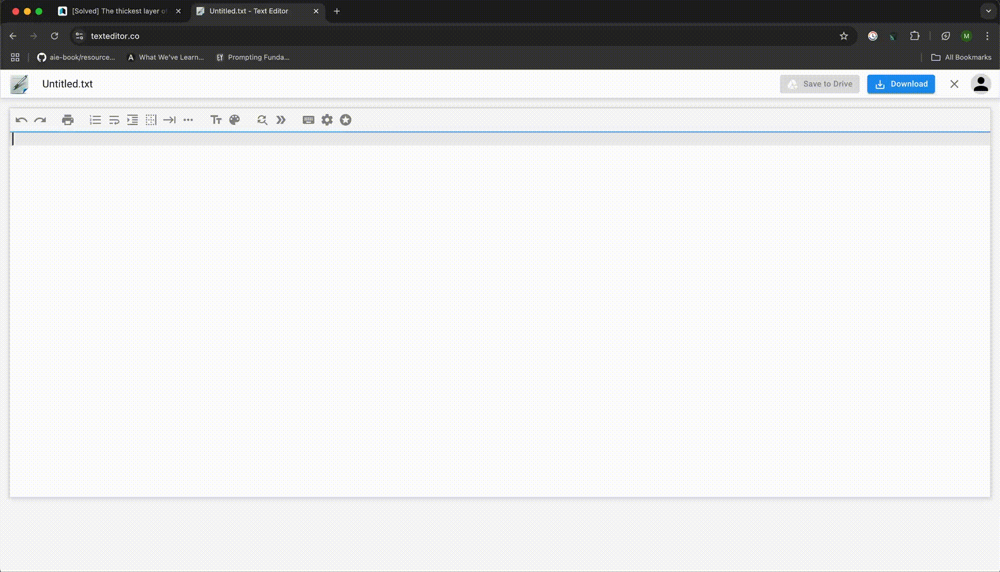

# Clipper - Browser Extension Clipboard Manager

A powerful and user-friendly clipboard manager browser extension that enhances your copy-paste workflow with advanced features and keyboard shortcuts.

## Features

- 📋 Advanced clipboard management
- ⌨️ Convenient keyboard shortcuts
- 🔄 Real-time clipboard history
- 🎯 Quick access through popup interface
- 🌐 Works across all websites
- 🔒 Secure clipboard handling

## Installation

1. Clone this repository or download the source code
2. Open your browser's extension management page
   - Chrome: Navigate to `chrome://extensions/`
   - Edge: Navigate to `edge://extensions/`
3. Enable "Developer mode"
4. Click "Load unpacked" and select the project directory

## Usage

- Click the extension icon in your browser toolbar to access the clipboard history
- Use the popup interface to manage your clipboard items
- Access the overlay interface for quick clipboard operations
- Press ⌘ + ⌥ + number (1-9) to quickly paste from your clipboard history
- All copy operations are automatically saved to your clipboard history
- Customize keyboard shortcuts through the extension settings

## Permissions

The extension requires the following permissions:
- `clipboardRead`: To access clipboard content
- `clipboardWrite`: To modify clipboard content
- `storage`: To save clipboard history
- `scripting`: For enhanced functionality
- `activeTab`: To interact with the current tab

## Technical Details

- Built with Manifest V3
- Uses modern JavaScript
- Implements background service workers
- Features a responsive overlay interface

## Files

- `manifest.json`: Extension configuration
- `background.js`: Background service worker
- `content.js`: Content script for webpage interaction
- `popup.html/js`: Extension popup interface
- `overlay.html/js`: Overlay interface for quick access
- `icon.png`: Extension icon

## Contributing

Contributions are welcome! Please feel free to submit a Pull Request.

## License

This project is open source and available under the MIT License.

## Version

Current version: 1.0

## TODO

- [ ] Add compatibility with Google Docs
